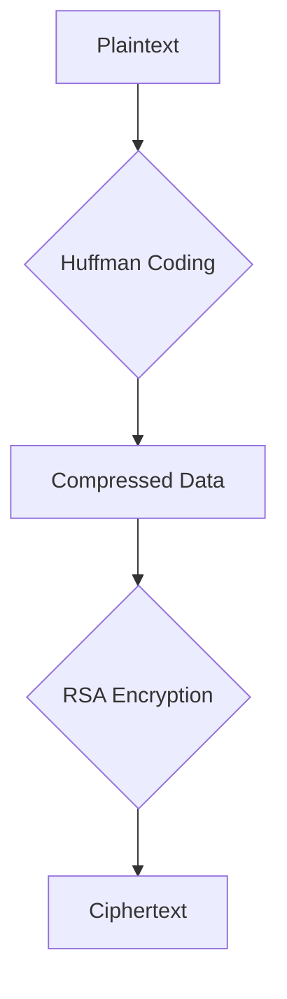

# Huffman Cipher 🔐


[](https://www.python.org/)
[](LICENSE)
[](PLACEHOLDER_URL)

A hybrid encryption system that combines Huffman coding for compression with the RSA cipher for security. This project allows you to achieve both data compression and encryption in a single, efficient process.

## 🏛️ Architecture

The project follows a straightforward architecture, combining compression and encryption into a single workflow:



## ✨ Features

-   **📉 High Compression Ratio:** Achieves significant size reduction (average 40-60%) using Huffman coding.
-   **🔑 Secure Encryption:** Implements the RSA algorithm for secure public-key encryption.
-   **🔄 Bidirectional:** Supports both encryption/compression and decryption/decompression.
-   **📊 Statistical Analysis:** Provides insights into the compression ratio and entropy of the data.
-   **🐍 Python-Powered:** Built entirely in Python with no external libraries, making it lightweight and easy to understand.

## 🚀 Getting Started

### Prerequisites

*   Python 3.x

### Installation

1.  Clone the repository:
    ```sh
    git clone https://github.com/your-username/huffman-cipher.git
    ```
2.  Navigate to the project directory:
    ```sh
    cd huffman-cipher
    ```

### Usage

You can run the main script `HuffmanCipher.py` to perform encryption and decryption. The script will prompt you for the necessary inputs (e.g., `p`, `q`, `e`, and the message to be encrypted).

```sh
python HuffmanCipher.py
```

##🤝 Contributing

Contributions are welcome! If you have any ideas, suggestions, or bug reports, please open an issue or submit a pull request.

1.  Fork the Project
2.  Create your Feature Branch (`git checkout -b feature/AmazingFeature`)
3.  Commit your Changes (`git commit -m 'Add some AmazingFeature'`)
4.  Push to the Branch (`git push origin feature/AmazingFeature`)
5.  Open a Pull Request

## 📄 License

This project is licensed under the MIT License - see the [LICENSE](LICENSE) file for details.
